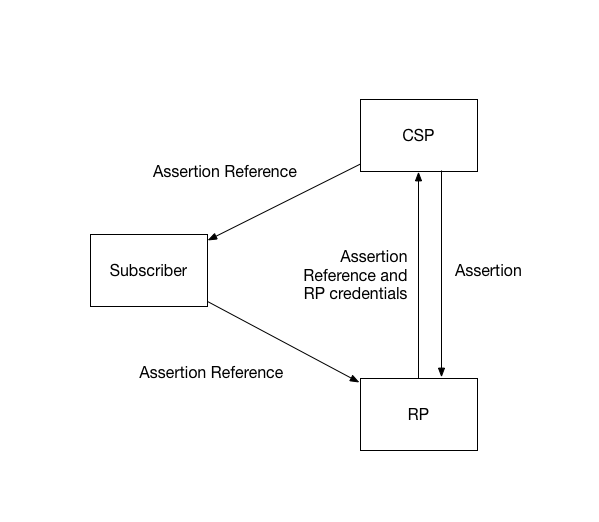
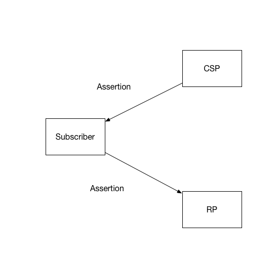

## 6. Assertion Presentation

Assertions MAY be presented in either an *indirect* or *direct* manner from the CSP to the RP. Each model has its benefits and drawbacks, but both require the proper validation of the assertion. Assertions MAY also be proxied to facilitate federation between CSPs and RPs under specific circumstances, as discussed in section 4.1.4.

### 6.1. Indirect presentation

In the *indirect* model, the subscriber is given an assertion reference to present to the RP, such as an HTTP redirect. The assertion reference itself contains no information about the subscriber. The RP presents the assertion reference to the CSP, usually along with authentication of the RP itself, to fetch the assertion. 

**Figure 1: Indirect presentation**

In this model, the assertion itself is requested directly from the CSP to the RP, minimizing chances of interception and manipulation by a third party (including the subscriber themselves). This also allows the RP to query the CSP for additional attributes about the subscriber not included in the assertion itself.

The assertion is still considered a *bearer* assertion if the artifact required to fetch the Assertion does not require presentation of additional proof of key possession after the assertion has been fetched.

In the indirect method, there are more network transactions required, but the information is limited to the parties that need it. Since an RP is expecting to get an assertion only from the CSP directly, the attack surface is reduced.

The assertion SHALL be validated including issuer verification, signature validation, and audience restriction.

### 6.2. Direct Presentation

In the *direct* model, the CSP creates an assertion and sends it directly to the subscriber after successful authentication. The assertion is used by the subscriber to authenticate to the RP. This is often handled by mechanisms within the subscriber’s browser.) 

**Figure 2: Direct presentation**

In the direct method, an assertion is visible to the user, which could potentially cause leakage of system information included in the assertion. Since the assertion is visible to the subscriber, the direct method also allows the assertion to be replayed to other RPs by the subscriber. 

The RP SHALL protect itself against injection of manufactured or captured assertions by use of cross-site scripting protection or other accepted techniques. 

The assertion SHALL be validated including issuer verification, signature validation, and audience restriction.

### 6.3. Assertion proxying

In some implementations, a proxy takes in an assertion from the CSP and creates a derived assertion when interacting directly with the RP, acting as an intermediary between the subscriber, CSP, and the RP. From the perspective of the true CSP, the proxy is a single RP. From the perspective of the true RPs, the proxy is a single CSP. (See section 4.1.4.) 

There are several common reasons for such proxies:

- Portals that provide users access to multiple RPs that require user authentication

- Web caching mechanisms that are required to satisfy the RP’s access control policies, especially when client-authenticated TLS with the subscriber is used

- Network monitoring and/or filtering mechanisms that terminate TLS in order to inspect and manipulate the traffic

### 6.4. Protecting Information

Communications between the CSP and the RP SHALL be protected in transit. Current implementations tend to do this by using HTTP over TLS and pass the authentication assertion in the HTTP header.

Note that the CSP may have access to information that may be useful to the RP in enforcing security policies, such as device identity, location, system health checks, and configuration management. If so, it may be a good idea to pass this information along to the RP within the bounds of the subscriber's privacy preferences.

